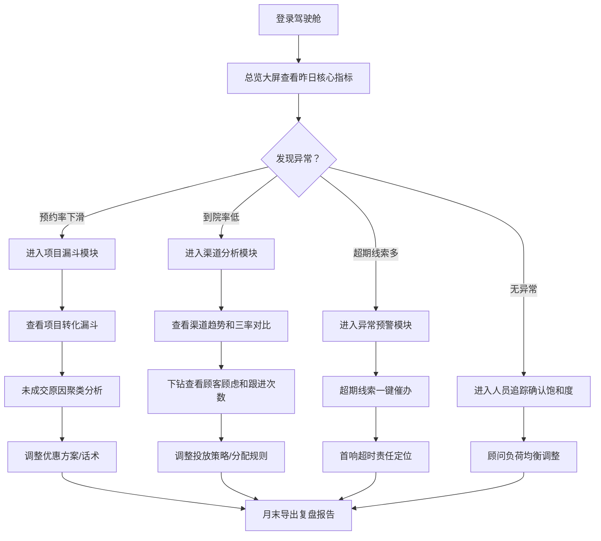

## 1. 产品概述

医美私域客资运营驾驶舱——面向医美机构老板、市场负责人和运营总监的数据驱动决策平台，解决私域客资质量看不见、跟进效率算不清、投放回收摸不准的核心痛点。通过六大盘模块，将分散在各渠道、各顾问、各项目的客资数据统一聚合，实现从线索入池到成交转化的全链路可视化，让管理者每天 10 分钟看清经营全局。

- 核心价值：用数据替代直觉，让每一分投放预算和每一个顾问动作都可量化、可追溯、可优化
- 目标市场：年营收 500 万-2 亿的中大型医美机构，私域月客资量 200+ 的运营团队

## 2. 核心功能

### 2.1 用户角色

| 角色 | 核心诉求 | 核心权限 |
|------|----------|----------|
| 机构老板 | 投放 ROI、成交金额、异常预警 | 全部模块查看 + 复盘报告导出 |
| 市场负责人 | 渠道质量、成本效率、预约/到院率 | 渠道分析 + 项目漏斗 + 异常预警 |
| 运营总监 | 跟进效率、人员饱和度、超期线索 | 总览大屏 + 人员追踪 + 异常预警 + 复盘报告 |

### 2.2 功能模块

1. **总览大屏**：昨日核心指标概览、渠道客资量排名、项目转化漏斗快照、实时异常提醒
2. **渠道分析**：渠道客资量趋势、渠道成本与 ROI、有效率/预约率/到院率对比、渠道下钻明细
3. **项目漏斗**：各项目线索→预约→到院→成交全链路漏斗、未成交原因聚类、项目间预约率/到院率横向对比
4. **人员追踪**：顾问跟进饱和度热力图、首响时长分布、个人转化漏斗、老客复购贡献和转介绍占比
5. **异常预警**：超期未跟进线索列表、预约率/到院率下滑预警、首响超时预警、渠道质量骤变提醒
6. **复盘报告**：月度关键指标汇总、环比变化分析、渠道/项目/人员排名、报告导出为 PDF

### 2.3 页面详情

| 页面名称 | 模块名称 | 功能描述 |
|----------|----------|----------|
| 总览大屏 | 核心指标卡片区 | 昨日新增客资数、有效率、10 分钟首响率、预约率、到院率、成交金额，环比涨跌箭头 |
| 总览大屏 | 渠道客资量排名 | 横向柱状图，按渠道展示昨日客资量 Top N，点击可跳转渠道分析 |
| 总览大屏 | 项目转化快照 | 迷你漏斗图，展示全机构线索→预约→到院→成交的整体转化率 |
| 总览大屏 | 实时异常滚动条 | 底部横向滚动预警信息条，显示超期线索数、预警项，点击跳转异常预警 |
| 渠道分析 | 渠道趋势图 | 折线图，支持多渠道叠加对比，时间维度可切换 7 日/30 日/自定义 |
| 渠道分析 | 渠道成本录入面板 | 弹窗表单，录入各渠道投放金额，自动计算单客成本和 ROI |
| 渠道分析 | 有效率/预约率/到院率对比 | 分组柱状图，按渠道三率并列对比，标红低于均值的渠道 |
| 渠道分析 | 渠道下钻明细表 | 可展开表格，显示某渠道下各客资的顾虑标签、跟进次数、当前状态 |
| 项目漏斗 | 项目转化漏斗图 | 纵向漏斗，按项目展示线索→预约→到院→成交各环节转化率和流失量 |
| 项目漏斗 | 未成交原因聚类 | 环形图 + 标签云，按频次排列未成交原因（价格顾虑、信任不足、时间冲突等） |
| 项目漏斗 | 项目横向对比表 | 表格，各项目预约率、到院率、成交率、客单价横向排列，标红下滑项 |
| 人员追踪 | 顾问饱和度热力图 | 日历热力图，每位顾问每日在跟线索量，颜色深浅表示负荷程度 |
| 人员追踪 | 首响时长分布 | 直方图，按时间区间（<5min/5-10min/10-30min/>30min）统计首响分布 |
| 人员追踪 | 个人转化漏斗 | 可切换顾问的漏斗图，对比个人与团队平均转化率 |
| 人员追踪 | 复购与转介绍 | 双指标卡片，老客复购贡献金额及占比、转介绍客资数及占比 |
| 异常预警 | 超期线索列表 | 表格，超期未跟进线索明细，包含线索来源、分配顾问、超期时长、一键催办 |
| 异常预警 | 指标下滑预警 | 卡片组，预约率/到院率较上周同期下降超 5% 的渠道或项目，红色警示 |
| 异常预警 | 首响超时预警 | 列表，首响超 30 分钟的线索，显示等待时长、归属顾问 |
| 异常预警 | 渠道骤变提醒 | 卡片，某渠道有效率或到院率较前日波动超 20% 时自动触发 |
| 复盘报告 | 月度指标汇总 | 大数字卡片 + 环形进度条，本月核心 KPI 完成度 |
| 复盘报告 | 环比变化分析 | 涨跌箭头 + 迷你趋势线，与上月对比各指标变化 |
| 复盘报告 | 排名榜 | 渠道 ROI 排名、项目转化率排名、顾问成交额排名 |
| 复盘报告 | 报告导出 | 按钮，将当前报告页面导出为 PDF 文件 |

## 3. 核心流程

运营总监每日工作流：登录→总览大屏确认昨日全局→发现短视频渠道到院率低→下钻渠道分析查看详情→查看顾客顾虑标签和顾问跟进次数→决定调整投放话术或分配规则。

## 4. 用户界面设计

### 4.1 设计风格

- **主色调**：深蓝黑 (#0B1120) 为底，搭配翡翠绿 (#00D4AA) 和琥珀金 (#F5A623) 作为强调色，传达专业、数据驱动的科技感
- **辅助色**：预警红 (#FF4757)、信息蓝 (#4A90D9)、中性灰 (#64748B)
- **按钮风格**：圆角微弧 (8px)，主按钮翡翠绿填充，次按钮边框描边，悬停微光晕效果
- **字体**：数字/数据使用 DIN Alternate 或 JetBrains Mono，中文标题使用思源黑体 (Noto Sans SC)，正文使用系统字体栈
- **布局风格**：左侧固定导航栏 + 顶部面包屑 + 内容区卡片式布局，卡片悬浮阴影，间距 16px/24px
- **图表风格**：深色半透明背景卡片内嵌图表，数据点悬停 tooltip，渐变填充面积图，带微动画的数字跳动
- **图标风格**：线性描边图标 (24px)，与文字等高对齐

### 4.2 页面设计概览

| 页面名称 | 模块名称 | UI 元素 |
|----------|----------|---------|
| 总览大屏 | 核心指标卡片区 | 6 列网格，每卡含图标+大数字+环比箭头，数字加载时 countUp 动画 |
| 总览大屏 | 渠道客资量排名 | 横向渐变柱状图，柱体末端标注数值，悬停显示详情 tooltip |
| 总览大屏 | 项目转化快照 | 4 级纵向漏斗，每层宽度按比例缩放，层间标注转化率百分比 |
| 总览大屏 | 实时异常滚动条 | 底部固定条，红色脉冲点 + 文字滚动，点击跳转 |
| 渠道分析 | 渠道趋势图 | 多色折线图，渐变面积填充，支持图例切换渠道显隐 |
| 渠道分析 | 成本录入面板 | 模态弹窗，表单含渠道下拉+金额输入+日期选择，提交后刷新 ROI |
| 渠道分析 | 三率对比 | 分组柱状图，每组 3 根柱子(有效/预约/到院)，低于均值标红 |
| 渠道分析 | 下钻明细表 | 可展开行表格，行内显示顾虑标签(彩色小药丸)和跟进次数徽章 |
| 项目漏斗 | 转化漏斗图 | 交互式漏斗，悬停某层高亮并弹出流失原因 top3 |
| 项目漏斗 | 未成交原因聚类 | 中心环形图 + 周围标签云，标签大小按频次 |
| 项目漏斗 | 横向对比表 | 条件格式表格，下滑指标红色渐变背景 |
| 人员追踪 | 饱和度热力图 | 7×N 日历格，颜色从绿→黄→红渐变，悬停显示具体线索数 |
| 人员追踪 | 首响分布 | 4 区间直方图，>10min 区间标红，平均值竖线标注 |
| 人员追踪 | 个人转化漏斗 | 可下拉切换顾问，个人漏斗叠加团队平均虚线漏斗 |
| 人员追踪 | 复购与转介绍 | 双大数字卡片 + 环形进度条，占位百分比弧形 |
| 异常预警 | 超期线索列表 | 红色左边框表格行，超期时长红色高亮，催办按钮绿色小按钮 |
| 异常预警 | 指标下滑预警 | 预警卡片网格，红色渐变边框，下滑百分比大字 + 迷你趋势线 |
| 异常预警 | 首响超时预警 | 列表，等待时长倒计时样式，归属顾问头像+姓名 |
| 异常预警 | 渠道骤变提醒 | 卡片，波幅箭头图标 + 变化百分比，正负色区分 |
| 复盘报告 | 月度指标汇总 | 大数字 + 环形进度条，完成度百分比弧形动画 |
| 复盘报告 | 环比变化 | 涨绿跌红箭头 + 迷你 sparkline 折线图 |
| 复盘报告 | 排名榜 | 1-3 名金银铜奖牌图标，4+ 名序号，条形进度条 |
| 复盘报告 | 报告导出 | 固定底部操作栏，PDF 导出按钮带下载图标 |

### 4.3 响应式设计

- 桌面优先设计，最低支持 1280px 宽度
- 1280-1920px：标准布局，6 列指标卡片
- <1280px：指标卡片改为 3×2 网格，侧边栏折叠为图标模式
- 移动端暂不支持，提示使用桌面端访问

## 5. 数据说明

本产品为前端驾驶舱展示，所有数据使用 Mock 数据模拟真实业务场景，不涉及后端服务。数据包含：
- 渠道数据：短视频、小红书、美团、朋友圈、转介绍、自然到院等 6 个渠道
- 项目数据：注射美容、光电项目、手术类、皮肤管理、抗衰项目等 5 个项目
- 人员数据：8 位顾问的跟进和转化数据
- 时间范围：近 30 天日级数据 + 近 12 个月月级数据
