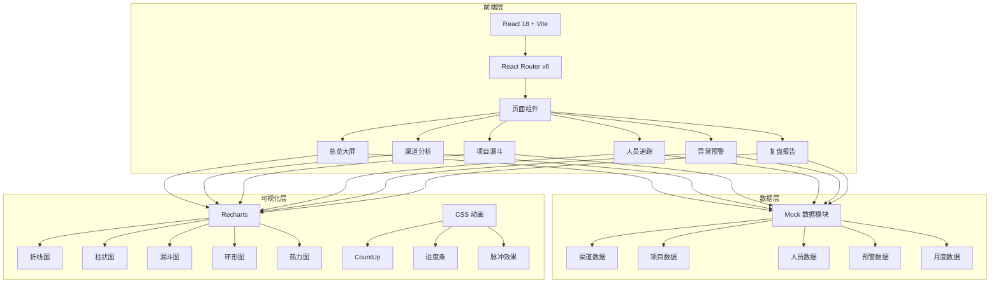
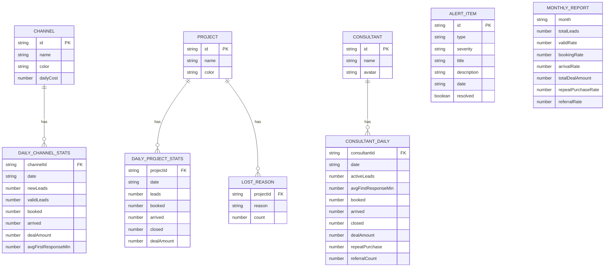

## 1. 架构设计



## 2. 技术说明

- **前端框架**：React@18 + TypeScript
- **构建工具**：Vite
- **样式方案**：Tailwind CSS@3 + CSS Modules（用于复杂动画）
- **路由**：React Router v6
- **图表库**：Recharts（折线图、柱状图、面积图）+ 自定义 SVG（漏斗图、热力图）
- **动画库**：framer-motion（页面切换、组件入场动画）
- **数据管理**：React Context + 自定义 Hooks，无后端，全部 Mock 数据
- **PDF 导出**：html2canvas + jsPDF
- **后端**：无，纯前端项目
- **数据库**：无，使用 TypeScript 常量文件模拟数据

## 3. 路由定义

| 路由 | 用途 | 页面组件 |
|------|------|----------|
| `/` | 重定向到总览大屏 | Redirect |
| `/overview` | 总览大屏，核心指标概览 | OverviewPage |
| `/channel` | 渠道分析，渠道质量与成本 | ChannelPage |
| `/funnel` | 项目漏斗，项目转化分析 | FunnelPage |
| `/personnel` | 人员追踪，顾问跟进效率 | PersonnelPage |
| `/alert` | 异常预警，超期和下滑预警 | AlertPage |
| `/report` | 复盘报告，月度复盘与导出 | ReportPage |

## 4. 数据模型

### 4.1 数据模型定义



## 5. 项目结构

```
src/
├── main.tsx                    # 入口文件
├── App.tsx                     # 根组件，路由配置
├── index.css                   # 全局样式 + Tailwind
├── types/                      # TypeScript 类型定义
│   └── index.ts
├── data/                       # Mock 数据
│   ├── channels.ts
│   ├── projects.ts
│   ├── consultants.ts
│   ├── alerts.ts
│   └── reports.ts
├── hooks/                      # 自定义 Hooks
│   ├── useCountUp.ts
│   └── useDateRange.ts
├── components/                 # 通用组件
│   ├── Layout/
│   │   ├── Sidebar.tsx
│   │   ├── Header.tsx
│   │   └── PageWrapper.tsx
│   ├── Cards/
│   │   ├── MetricCard.tsx
│   │   └── AlertCard.tsx
│   ├── Charts/
│   │   ├── FunnelChart.tsx
│   │   ├── HeatmapChart.tsx
│   │   ├── RingChart.tsx
│   │   └── Sparkline.tsx
│   └── UI/
│       ├── Badge.tsx
│       ├── Modal.tsx
│       └── Table.tsx
└── pages/                      # 页面组件
    ├── OverviewPage.tsx
    ├── ChannelPage.tsx
    ├── FunnelPage.tsx
    ├── PersonnelPage.tsx
    ├── AlertPage.tsx
    └── ReportPage.tsx
```
